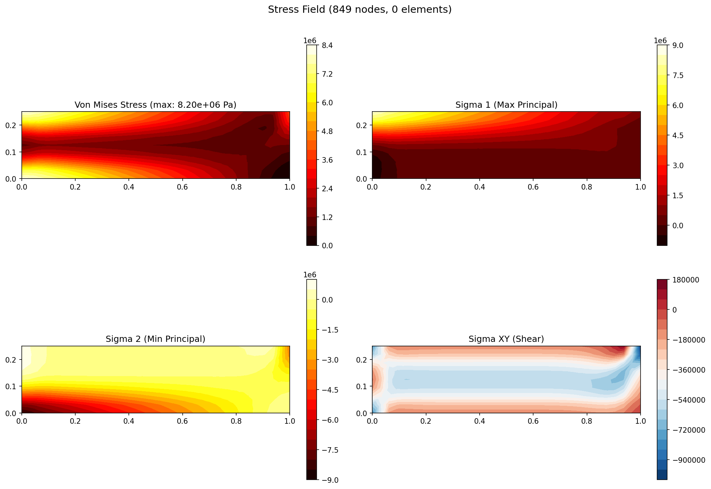
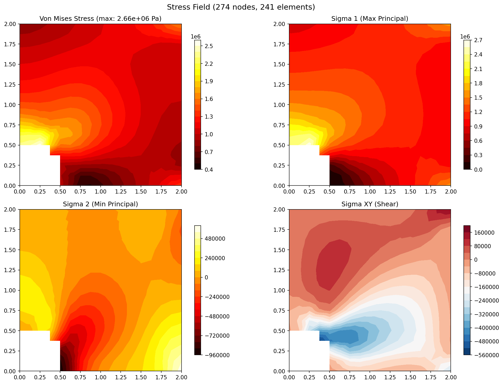
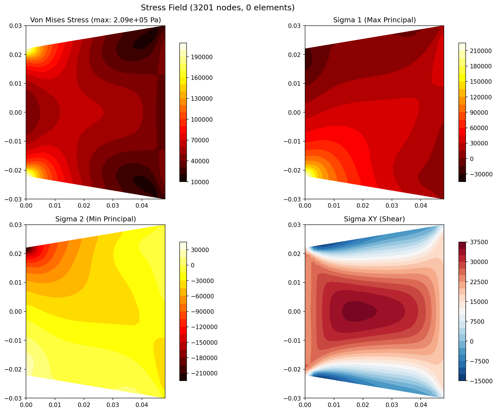

# Cauchy

### 2D/3D Finite Element Structural Solver + Desktop Application

A C++20 finite element solver with a native Qt 6 desktop application for interactive structural analysis. Solves plane stress/strain and 3D solid mechanics problems with adaptive mesh refinement, geometric nonlinearity, and transient dynamics. Validated against 10 analytical benchmarks with 86 Google Test cases.

**[View Portfolio Site](https://ajeet-krish.github.io/fea-2d/)** | **[Download Desktop App](#build--install)** | **[GitHub](https://github.com/ajeet-krish/fea-2d)**

---

## Screenshots

<!-- Replace these with actual desktop app screenshots -->
<table>
  <tr>
    <td align="center">
      
      <br><em>Von Mises stress contour on cantilever beam</em>
    </td>
    <td align="center">
      
      <br><em>Stress concentration at plate with hole</em>
    </td>
    <td align="center">
      
      <br><em>Cook's membrane bending + shear</em>
    </td>
  </tr>
</table>

---

## What It Does

- **Solves 2D and 3D structural problems** -- plane stress/strain, solid mechanics with hex and tet elements, thermal loading, and transient dynamics
- **Desktop GUI for interactive analysis** -- mesh generation, boundary condition assignment, solver execution, and results visualization in a native Qt 6 application
- **Validated against analytical solutions** -- cantilever beam, Cook's membrane, plate with hole, L-bracket, patch test, Michell truss, thermal cylinder, and 3D benchmarks
- **Production-grade tooling** -- async solver, 6 analysis plots, project file save/load, PNG export, and Google Test CI on macOS + Linux

---

## Key Features

| Category | Details |
|----------|---------|
| **Elements** | Bar, Q4 (bilinear quad), Q8 (serendipity quad), T3 (linear triangle), H8 (hexahedron), T4 (tetrahedron) |
| **Solvers** | Cholesky direct + Conjugate Gradient iterative |
| **Preconditioners** | Jacobi, SSOR, Incomplete Cholesky IC(0), Block Jacobi (Additive Schwarz) |
| **Locking Mitigation** | Selective Reduced Integration (SRI), B-Bar method for Q4 bending |
| **Adaptive Refinement** | ZZ error estimator (SPR) + red-green h-refinement with GCI convergence tracking |
| **Geometric Nonlinearity** | Total Lagrangian Newton-Raphson with Green-Lagrange strain |
| **Dynamic Analysis** | Newmark-beta time integration + modal analysis (eigenvalue solver) |
| **Contact Mechanics** | Node-to-surface frictionless penalty method |
| **Thermal Loading** | Steady-state thermoelastic analysis with temperature fields |
| **Assembly** | COO natural assembly (append-only) compressed to CSR for fast SpMV |
| **Parallelization** | OpenMP for element assembly and stress recovery |
| **Output** | JSON pipeline: meta, displacement, stress, mesh, convergence, adaptive convergence |

---

## Desktop Application

The desktop app is the primary deliverable -- a native FEA tool for mesh-to-solve-to-visualize workflows, similar to Abaqus CAE or ANSYS Mechanical but focused on 2D/3D solid mechanics.

### Workflow

1. **Mesh** -- Generate structured quad meshes with grading, or import from JSON. Quality metrics displayed in real-time.
2. **Boundary Conditions** -- Assign Dirichlet (fixed) and Neumann (force) conditions via the BC editor. Visual symbols on the viewport (triangles, arrows, circles).
3. **Solve** -- Run Cholesky or CG solver asynchronously. Progress bar in status bar. Auto-switches to CG for large meshes.
4. **Visualize** -- Contour plots (Von Mises, principal stresses, displacement), deformed shape with scaling, principal stress arrows, mesh quality overlay.
5. **Analyze** -- Six analysis tabs: stress histogram, energy balance, displacement profile, load-displacement curve, error heatmap, convergence study.
6. **Export** -- Save project as `.cauchy` JSON file. Export screenshots as PNG.

### Architecture

```
Cauchy Desktop (Qt 6)
├── Application Shell (QMainWindow)
│   ├── Menu bar (File, Edit, Solve, View, Help)
│   ├── Toolbar (solver controls, view toggles)
│   ├── Status bar (solver progress, mesh stats)
│   ├── Left dock: Mesh & BC editor
│   ├── Right dock: Properties & results
│   ├── Central: 2D viewport (QPainter mesh renderer)
│   └── Bottom dock: Analysis plots (QTabWidget, 6 tabs)
│
├── Solver Bridge (native C++ link, no IPC)
│   ├── Mesh model (mirrors fea::Mesh)
│   ├── Material model (mirrors fea::Material)
│   ├── BC/Load model (QAbstractItemModel)
│   ├── Solver runner (QThread, async)
│   └── Result model (QAbstractItemModel for tables)
│
├── Visualization Engine
│   ├── 2D viewport (QPainter with pan/zoom)
│   ├── Contour mapping (turbo, viridis, hot, coolwarm, RdBu_r)
│   ├── Principal stress arrows (element-based)
│   ├── Boundary condition symbols (triangles, arrows)
│   └── Mesh quality overlay
│
└── Analysis Plots (bottom dock, collapsible)
    ├── Stress Histogram: sigma_xx, sigma_yy, von_mises distributions
    ├── Energy Balance: strain energy vs work done
    ├── Displacement Profile: uy along mesh edge
    ├── Load-Displacement: force vs max displacement
    ├── Error Map: per-element ZZ error indicator heatmap
    └── Convergence: log-log mesh refinement with GCI
```

### Why Qt 6

| Capability | Cauchy Desktop | Abaqus CAE | ANSYS Mechanical | CalculiX + CGX |
|-----------|----------------|------------|------------------|-----------------|
| 2D elements | Q4, Q8, Bar, T3 | Full 3D | Full 3D | 2D + 3D |
| 3D elements | H8, T4 | Full 3D | Full 3D | Full 3D |
| Static linear | Yes | Yes | Yes | Yes |
| Adaptive refinement | Yes (ZZ estimator) | Yes (h-adaptive) | Yes | No |
| GUI framework | Qt (custom) | Qt (proprietary) | Proprietary | GTK (CGX) |
| Solver | Cholesky + CG | Direct + Iterative | Direct + Iterative | Sparse direct |
| Cost | Free (MIT) | ~\$20K/license | ~\$50K/license | Free (GPL) |
| Source | Full source | Black box | Black box | Partial |

---

## Quick Start

### Desktop Application (recommended)

```bash
./build-desktop.sh
```

This configures, builds, installs to `/Applications`, and launches the app.

### Solver (command line)

```bash
# Build
cmake -B build && cmake --build build -j$(sysctl -n hw.ncpu)

# Run validation cases
./build/FEA_Cantilever 32              # Cantilever beam (32x8 mesh)
./build/FEA_Cantilever 32 --q8         # Cantilever with Q8 elements
./build/FEA_Cook 32                    # Cook's membrane (32x32)
./build/FEA_PlateHole 16               # Plate with hole (16x16)
./build/FEA_LBracket 32                # L-bracket (32x32)
./build/FEA_Patch                      # Patch test (4x4)
./build/FEA_Michell                    # Michell truss
./build/FEA_AdaptHole 8 --iters 4      # Adaptive refinement
./build/FEA_ThermalCylinder            # Thermal cylinder (3D)
./build/FEA_Cantilever3D               # 3D cantilever (H8)
./build/FEA_PlateHole3D                # 3D plate with hole (H8)
./build/FEA_Lame3D                     # 3D Lame problem (H8)

# Run tests (86 tests)
./build/FEA_Tests

# Post-process (matplotlib PNGs)
python3 scripts/postprocess.py output/cantilever_32/ --all
python3 scripts/postprocess.py output/ --all-cases

# Preview portfolio site
python3 -m http.server -d docs 8765
open http://localhost:8765
```

---

## Architecture

```
fea.hpp  (assembly + solve orchestration)
├── fea_types.hpp        (types, enums, globals)
├── elements.hpp         (Bar, Q4, Q8, T3 stiffness)
├── elements_3d.hpp      (H8, T4 stiffness)
├── locking_mitigation.hpp (SRI, B-Bar)
├── sparse.hpp           (COO/CSR sparse matrix)
├── solver.hpp           (Cholesky + CG)
├── preconditioners.hpp  (Jacobi, SSOR, IC(0), Block Jacobi)
├── mesh.hpp             (structured quad mesher)
├── postprocess.hpp      (stress recovery, Von Mises)
├── adaptivity.hpp       (ZZ SPR, error indicators, red-green refinement)
├── convergence.hpp      (GCI, mesh convergence)
├── nonlinear.hpp        (Total Lagrangian Newton-Raphson)
├── dynamics.hpp         (Newmark-beta, modal analysis)
└── contact.hpp          (node-to-surface penalty)
```

### Data Flow

```
C++ Solver
  |
  +--> output/case/meta.json           (mesh stats, material, max values)
  +--> output/case/displacement.json   (nodal ux, uy)
  +--> output/case/stress.json         (element sigma_xx, yy, xy, VM, principal)
  +--> output/case/mesh.json           (nodes, element connectivity)
  +--> output/case/convergence.json    (h-refinement study, GCI)
  +--> output/case/adaptive_convergence.json  (adaptive refinement history)
  |
  +--> scripts/postprocess.py          (matplotlib PNGs)
  +--> scripts/convert_for_web.py      (browser-optimized JSON)
         +--> docs/assets/data/*.json  (Three.js viewer data)
```

---

## Validation Coverage

| Case | Dimension | Element | Analytical Reference | What It Proves |
|------|-----------|---------|---------------------|----------------|
| Cantilever beam | 2D | Q4, Q8 | delta = PL^3/(3EI), Timoshenko | Shear locking (Q4), quadratic completeness (Q8) |
| Michell truss | 2D | Bar | Published truss solutions | Bar element assembly |
| Cook's membrane | 2D | Q4, Q8 | Tip displacement ~13.68 mm | Bending + shear, Q4 vs Q8 |
| L-bracket | 2D | Q4 | SCF ~2-3 at fillet | Stress concentration, refinement |
| Patch test | 2D | Q4, Q8 | Exact for linear elements | Element verification (mandatory) |
| Plate with hole | 2D | Q4, Q8 | Kirsch: sigma_max = 3*sigma_inf | Stress concentration, adaptive refinement |
| Thermal cylinder | 3D | H8 | Steady-state thermoelastic | Thermal loading |
| Cantilever 3D | 3D | H8 | Euler-Bernoulli beam | 3D element verification |
| Plate with hole 3D | 3D | H8 | 3D stress concentration | 3D stress recovery |
| Lame problem | 3D | H8 | Analytical thick cylinder | 3D plane strain |

---

## Project Structure

```
fea-2d/
├── CMakeLists.txt                  # Build config (solver + desktop)
├── build-desktop.sh                # One-command desktop build + install
├── README.md
├── CHANGELOG.md
│
├── src/                            # C++ solver (header-only)
│   ├── fea.hpp                     # Assembly + solve orchestration
│   ├── fea_types.hpp               # Types, enums, globals
│   ├── elements.hpp                # 2D element stiffness (Bar, Q4, Q8, T3)
│   ├── elements_3d.hpp             # 3D element stiffness (H8, T4)
│   ├── locking_mitigation.hpp      # SRI, B-Bar methods
│   ├── sparse.hpp                  # COO/CSR sparse matrix
│   ├── solver.hpp                  # Cholesky + CG solvers
│   ├── preconditioners.hpp         # Jacobi, SSOR, IC(0), Block Jacobi
│   ├── mesh.hpp                    # Structured quad mesher
│   ├── postprocess.hpp             # Stress recovery, Von Mises
│   ├── adaptivity.hpp              # ZZ SPR + red-green refinement
│   ├── convergence.hpp             # GCI, mesh convergence
│   ├── nonlinear.hpp               # Newton-Raphson (Total Lagrangian)
│   ├── dynamics.hpp                # Newmark-beta, modal analysis
│   ├── contact.hpp                 # Node-to-surface penalty
│   ├── fea_solver_c_api.cpp/.h     # C API for Rust/Tauri integration
│   │
│   ├── main_cantilever.cpp         # Validation case entry points
│   ├── main_cook.cpp
│   ├── main_plate_hole.cpp
│   ├── main_lbracket.cpp
│   ├── main_patch.cpp
│   ├── main_michell.cpp
│   ├── main_adapt_hole.cpp
│   ├── main_thermal.cpp
│   ├── main_cantilever_3d.cpp
│   ├── main_plate_hole_3d.cpp
│   ├── main_lame_3d.cpp
│   │
│   ├── fea_test.cpp                # Google Test suite (57 cases)
│   │
│   └── desktop/                    # Qt 6 desktop application
│       ├── main.cpp                # Entry point
│       ├── cauchy_app.hpp/cpp      # QApplication subclass
│       ├── main_window.hpp/cpp     # Main window (menus, docks, toolbar)
│       ├── mesh_editor.hpp/cpp     # Left dock: mesh + BC editor
│       ├── solver_panel.hpp/cpp    # Right dock: solver controls
│       ├── viewport_widget.hpp/cpp # Central: 2D QPainter renderer
│       ├── viewport_3d.hpp/cpp     # 3D OpenGL viewport
│       ├── result_model.hpp/cpp    # QAbstractItemModel for tables
│       ├── solver_runner.hpp/cpp   # QThread async solver
│       ├── project_io.hpp/cpp      # Save/load .cauchy files
│       ├── convergence_chart.hpp/cpp
│       ├── stress_histogram.hpp/cpp
│       ├── energy_balance_chart.hpp/cpp
│       ├── displacement_line_chart.hpp/cpp
│       ├── load_displacement_chart.hpp/cpp
│       ├── error_heatmap.hpp/cpp
│       ├── probe_tool.hpp/cpp      # Click-to-probe stress/displacement
│       ├── mesh_quality_overlay.hpp/cpp
│       └── about_dialog.hpp/cpp
│
├── tests/
│   └── test_c_api.cpp              # C API tests (29 cases)
│
├── scripts/
│   ├── postprocess.py              # JSON -> matplotlib PNGs
│   ├── convert_for_web.py          # JSON -> browser-optimized Three.js data
│   └── run_all_sims.py             # Batch runner
│
├── desktop/                        # Qt resources, .desktop, Info.plist
│   ├── resources.qrc
│   ├── cauchy.desktop
│   ├── Info.plist
│   ├── icon.icns
│   └── icon.png
│
├── docs/                           # Portfolio website
│   ├── index.html                  # Landing page
│   ├── cantilever.html             # Per-case pages with Three.js viewers
│   ├── cook.html
│   ├── lbracket.html
│   ├── patch.html
│   ├── plate_hole.html
│   ├── michell.html
│   ├── thermal_cylinder.html
│   ├── theory.html                 # FEA theory (shape functions, ZZ estimator)
│   ├── implementation.html         # Code architecture
│   ├── css/style.css               # Dark terminal theme
│   └── assets/
│       ├── js/                     # Three.js viewer components
│       ├── data/                   # Pre-processed browser JSON
│       └── images/                 # Generated PNG plots
│
├── output/                         # Simulation output (gitignored)
└── build/                          # CMake build (gitignored)
```

---

## Build Requirements

- **C++20 compiler** -- GCC 10+, Clang 12+, or Apple Clang 14+
- **CMake** -- 3.15 or later
- **OpenMP** -- optional, for parallel assembly
- **Google Test** -- fetched automatically via CMake FetchContent
- **Python 3.8+** -- for postprocessing scripts (optional)
- **NumPy + Matplotlib** -- for Python postprocessor (optional)
- **Qt 6** -- for desktop application only (`cmake -DCAUCHY_DESKTOP=ON`)

---

## License

MIT -- see repository for details.
